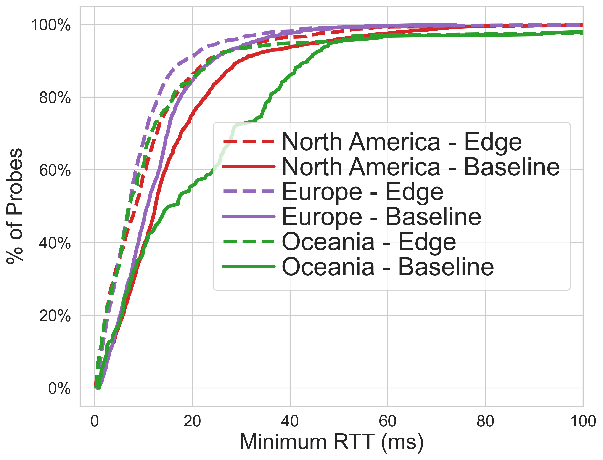
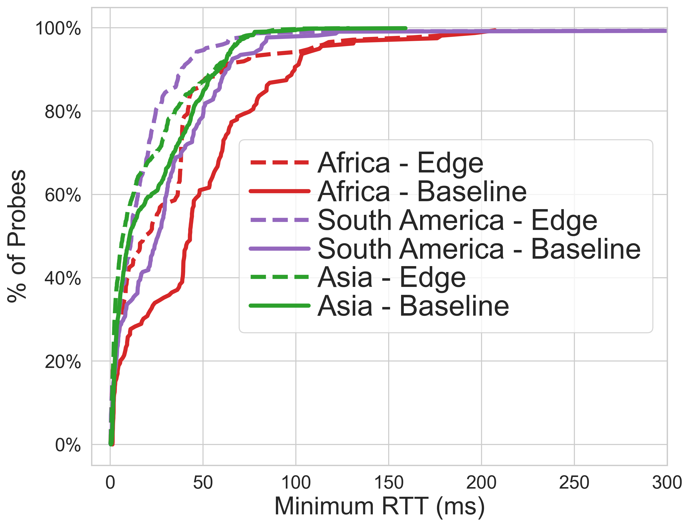

# Divided at the Edge - Measuring Performance and the Digital Divide of Cloud Edge Data Centers

Code to reproduce the results in [*Divided at the Edge - Measuring Performance and the Digital Divide of Cloud Edge Data Centers*](https://dl.acm.org/doi/10.1145/3629138) which was accepted in CoNEXT 2023.

## Abstract

> Cloud providers are highly incentivized to reduce latency. One way they do this is by locating data centers as close to users as possible. These "cloud edge" data centers are placed in metropolitan areas and enable edge computing for residents of these cities. Therefore, which cities are selected to host edge data centers determines who has the fastest access to applications requiring edge compute -- creating a digital divide between those closest and furthest from the edge. In this study we measure latency to the current and predicted cloud edge of three major cloud providers around the world. Our measurements use the RIPE Atlas platform targeting cloud regions, AWS Local Zones, and network optimization services that minimize the path to the cloud edge. An analysis of the digital divide shows rising inequality as the relative difference between users closest and farthest from cloud compute increases. We also find this inequality unfairly affects lower income census tracts in the US. This result is extended globally using remotely sensed night time lights as a proxy for wealth. Finally, we demonstrate that low earth orbit satellite internet can help to close this digital divide and provide more fair access to the cloud edge.

## Key Results

- **Latency Improvements**: Greater than 80% of probes in North America, Oceania, and Europe could reach the cloud edge in under 20ms -- which is required for head tracking.
- **Inequality and Unfairness**: We introduce inequality and unfairness metrics to analyze the cloud digital divide. Inequality is trending higher; for example, in Oceania the top 90% of users are over 200x further from a data center than the bottom 10%.
- **LEO Satellite Internet**: Using satellite network simulations we explore the potential for LEO satellites to reduce the cloud digital divide. We find the differences between the top and bottom 10% of users drops to lower than 10x when using LEO satellite internet.

---

RTT reductions from cloud edge in North America, Europe, and Oceania


RTT reductions from cloud edge in Africa, South America, and Asia


---

See RIPEAtlasGraphs.ipynb for steps to generate graphs in the paper from the RIPE Atlas measurement results, DigitalDivideGraphs.ipynb for steps to generate graphs related to the cloud digital divide, and StarlinkGraphs.ipynb for graphs related to our LEO satellite analysis.

## Data

### Ripe Atlas

Necessary data is downloaded using the RIPE Atlas API from the jupyter notebook, no additional downloads are necessary.

### Digital Divide

- Gridded population of the world from [SEDAC](https://sedac.ciesin.columbia.edu/data/set/gpw-v4-population-count-rev11) year 2020 at 15 arc-minute resolution. Download the file `gpw_v4_population_count_rev11_2020_15_min.tif` and place it in the `data` folder.
- [ESRI Updated Demographics](https://doc.arcgis.com/en/esri-demographics/latest/regional-data/updated-demographics.htm) downloading using [ArcGIS Online](https://www.arcgis.com/index.html). The census tract level is used, files should be placed in `data/ACS_Median_Household_Income_Variables_-_Boundaries/Tract_2.csv` and `data/ACS_Population_Variables_-_Boundaries/Tract_2.csv`
- GADM Administrative level 2 for the world, downloaded [here](https://www.gadm.org/data.html). The file should be placed in `data/gadm_410-levels.gpkg`.
- Annual VNL v2.1 for 2020 from [here](https://eogdata.mines.edu/nighttime_light/annual/v21/). This should be placed in `data/VNL_v21_npp_2020_global_vcmslcfg_c202205302300.median_masked.dat.tif`.

### Satellite

Results of the LEO satellite simulations can be downloaded from https://drive.google.com/file/d/1z8WjIIT0T20dIgsStQxCBc1bEgvcj65z/view This should be placed in the data/starlink_simulator directory

To create the simulation results (rather than downloading from the link above). You need to clone the Hypatia repo: [https://github.com/snkas/hypatia](https://github.com/snkas/hypatia) and follow their setup instructions.

Our list of ground stations are the 6 files found in `data/input_data/*.basic.txt`. Hypatia needs to be modififed to use these ground stations. Modify `paper/satellite_networks_state/main_helper.py` by adding inserting following code at line 86.

```
        elif gs_selection == "ground_stations_aws_af":
            satgen.extend_ground_stations(
                "input_data/ground_stations_aws_af.basic.txt",
                output_generated_data_dir + "/" + name + "/ground_stations.txt"
            )
        elif gs_selection == "ground_stations_aws_sa":
            satgen.extend_ground_stations(
                "input_data/ground_stations_aws_sa.basic.txt",
                output_generated_data_dir + "/" + name + "/ground_stations.txt"
            )
        elif gs_selection == "ground_stations_aws_na":
            satgen.extend_ground_stations(
                "input_data/ground_stations_aws_na.basic.txt",
                output_generated_data_dir + "/" + name + "/ground_stations.txt"
            )
        elif gs_selection == "ground_stations_aws_oc":
            satgen.extend_ground_stations(
                "input_data/ground_stations_aws_oc.basic.txt",
                output_generated_data_dir + "/" + name + "/ground_stations.txt"
            )
        elif gs_selection == "ground_stations_aws_eu":
            satgen.extend_ground_stations(
                "input_data/ground_stations_aws_eu.basic.txt",
                output_generated_data_dir + "/" + name + "/ground_stations.txt"
            )
        elif gs_selection == "ground_stations_aws_as":
            satgen.extend_ground_stations(
                "input_data/ground_stations_aws_as.basic.txt",
                output_generated_data_dir + "/" + name + "/ground_stations.txt"
            )
```

The satellite simulator can be run from the `paper/satellite_networks_state` directory of Hypatia for each region using:
`python3 main_starlink_550.py 120 5000 isls_plus_grid ground_stations_aws_af algorithm_free_one_only_over_isls 2`
`python3 main_starlink_550.py 120 5000 isls_plus_grid ground_stations_aws_oc algorithm_free_one_only_over_isls 2`
`python3 main_starlink_550.py 5 5000 isls_plus_grid ground_stations_aws_eu algorithm_free_one_only_over_isls 2`
`python3 main_starlink_550.py 120 5000 isls_plus_grid ground_stations_aws_na algorithm_free_one_only_over_isls 2`
`python3 main_starlink_550.py 120 5000 isls_plus_grid ground_stations_aws_sa algorithm_free_one_only_over_isls 2`
`python3 main_starlink_550.py 120 5000 isls_plus_grid ground_stations_aws_as algorithm_free_one_only_over_isls 2`

Note we run EU for a shorter duration to generate results faster due to the larger number of ground stations in that input data.
